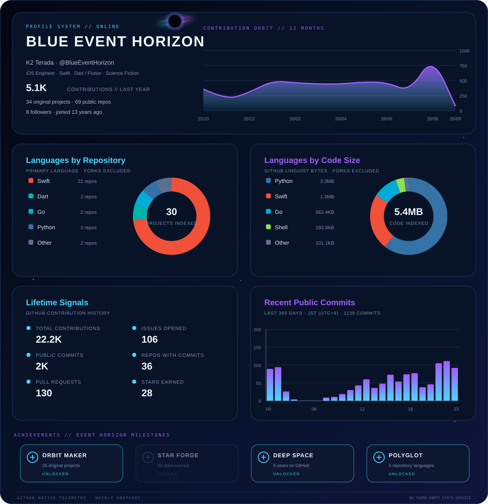

<p align="center">
  
</p>

<p align="center">
  <strong>iOS Engineer</strong> · Swift · Dart / Flutter · Science Fiction
</p>

<p align="center">
  <a href="https://qiita.com/BlueEventHorizon">Qiita</a>
  &nbsp;·&nbsp;
  <a href="https://zenn.dev/k2moons">Zenn</a>
</p>

---

<details>
  <summary>How this dashboard works</summary>
  <br />
  The dashboard is generated from GitHub GraphQL contribution summaries and public
  REST API data by a repository-owned Python script. Language charts exclude forks,
  and commit-hour statistics cover public commits from the last 365 days.
  GitHub Actions refreshes it once a week and commits only when the data changes.
  No third-party badge or statistics service is used.

  ```bash
  python3 -m unittest discover -s tests -v
  python3 scripts/generate_profile.py \
    --fixture tests/fixtures/github-profile.json \
    --output .claude/.temp/fixture-dashboard.svg
  ```
</details>
